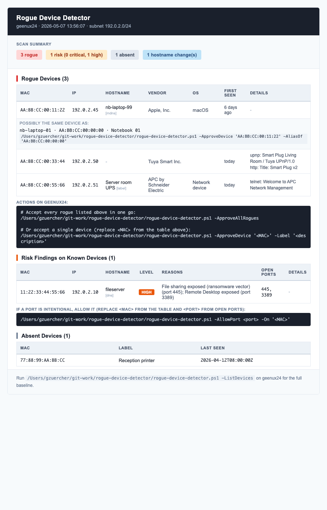

# Rogue Device Detector (RDD)

[](https://github.com/gzuercher/rogue-device-detector/releases) [](LICENSE) [](https://github.com/gzuercher/rogue-device-detector/actions/workflows/test.yml)

A standalone PowerShell script that detects unauthorized devices on your network. Built for MSPs and IT admins who need visibility into what's connected — without agents, cloud services, or vendor lock-in.

**What it does:** scans your network, builds a baseline of known devices, and emails you when something new shows up. Also monitors known devices for risky open ports and flags devices that disappear.

**What it doesn't do:** real-time monitoring, vulnerability scanning, or anything that requires a cloud backend. It is one PowerShell script and a JSON config file.

## What an alert looks like

[](https://htmlpreview.github.io/?https://raw.githubusercontent.com/gzuercher/rogue-device-detector/main/docs/samples/sample-report.html)

> Click the image for the full alert rendered in your browser, or open [`docs/samples/sample-report.html`](docs/samples/sample-report.html) locally. All MACs, IPs, and hostnames in the sample are synthetic (RFC 5737 + RFC 2606).

## Quick start

```powershell
# 1. Copy the example config and fill in your SMTP settings.
Copy-Item config.example.json config.json
notepad config.json

# 2. Run in learning mode to build the baseline (no alerts sent).
.\rogue-device-detector.ps1 -LearningMode

# 3. Review the baseline; -RemoveDevice to drop entries.
.\rogue-device-detector.ps1 -ListDevices

# 4. Schedule a weekly scan without -LearningMode.
```

For unattended deployment via an RMM, see **[Deployment](docs/deployment.md)**.

## Documentation

| Audience | Read |
|---|---|
| **Engineers / operators** — install, run, react to alerts | [Deployment](docs/deployment.md) · [Usage](docs/usage.md) · [Configuration](docs/configuration.md) · [Alerts](docs/alerts.md) · [Diagnostics](docs/diagnostics.md) · [Troubleshooting](docs/troubleshooting.md) |
| **Security reviewers** | [Security model](docs/security.md) · [SECURITY.md (vulnerability reporting)](SECURITY.md) |
| **Developers** — read or extend the script | [Architecture](docs/architecture.md) · [CONTRIBUTING.md](CONTRIBUTING.md) · [ROADMAP.md](ROADMAP.md) |

The complete documentation index is at **[docs/README.md](docs/README.md)**.

See [release notes](https://github.com/gzuercher/rogue-device-detector/releases) for changes between versions.
